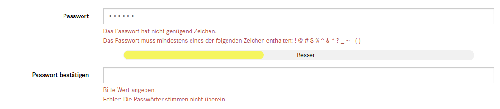

# Password Policy

----

OXID module for additional password validation, strength visualization and expiry rules.

# Professional Support

Do you like to use this project in a commercial project in a live environment? 
Better request profession support which may include depending on the contract:

- free updates
- installation support
- feature implementation
- bug fixes

Please contact professional-services@oxid-esales.com to get a offer.

## Installation

1. Clone the repository into the _modules/oxps/_ 
1. Execute included docs/install.sql on your database.
1. Add missing blocks see https://github.com/OXID-eSales/flow_theme/pull/154/files
1. Activate module it in admin area.

## Usage

1. In admin area, go to Administer Users -> Password Policy and adjust default settings to:
 * Set preferred password strength requirements
 * Set account block options on bad password attempts
